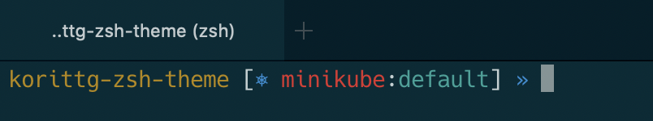
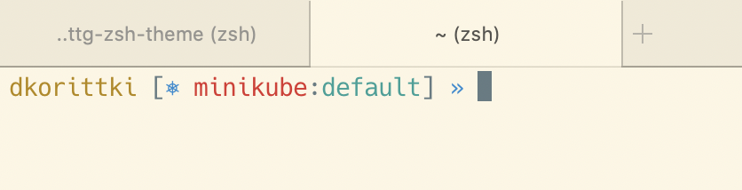

# korittg zsh prompt theme

Minimalistic yet informative zsh theme.





## Features

- Current directory (no full path)
- Git project and branch
- Kubernetes context and namespace (using kube-ps1 zsh plugin, if installed)
- Single line prompt
- Works well within all kinds of terminals and colors

The main porpuse for this theme was displaying information about current Kubernetes context and namespace,
as well as optically fitting nicely into terminal emulators embedded into IntelliJ (and the like),
VSCode, iTerm (including dark and light color profiles), and so on.

## Installing

Place [korittg.zsh-theme](korittg.zsh-theme) into your oh-my-zsh custom theme directory (usually `~/.oh-my-zsh/custom/themes`).  
Then edit your `.zshrc` to use the theme:

```sh
ZSH_THEME="korittg"
```

If you want Kubernetes integration, you need to install the kube-ps1 plugin:

```
plugins=(... kube-ps1 ...)
```
